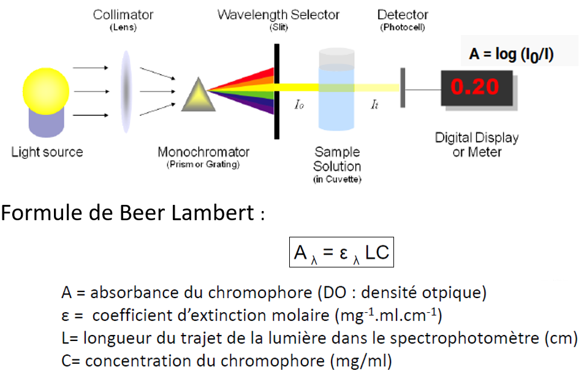
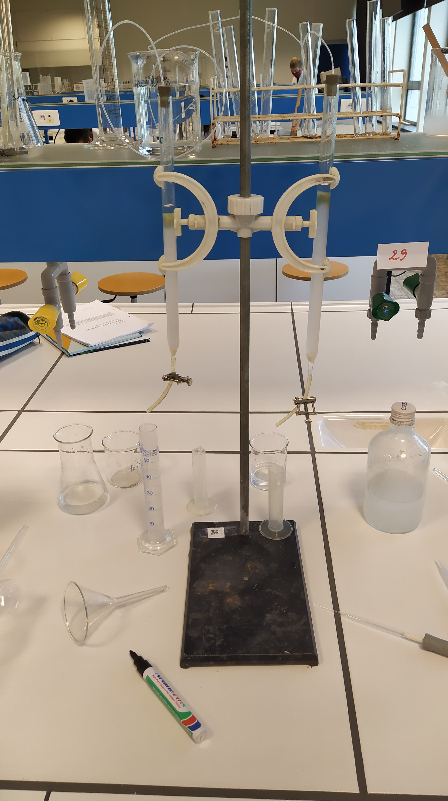
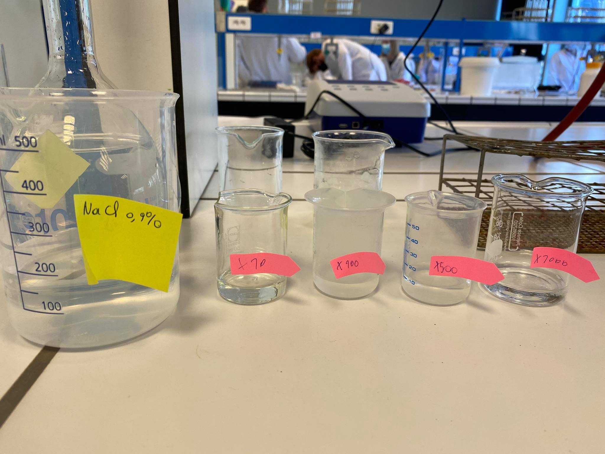
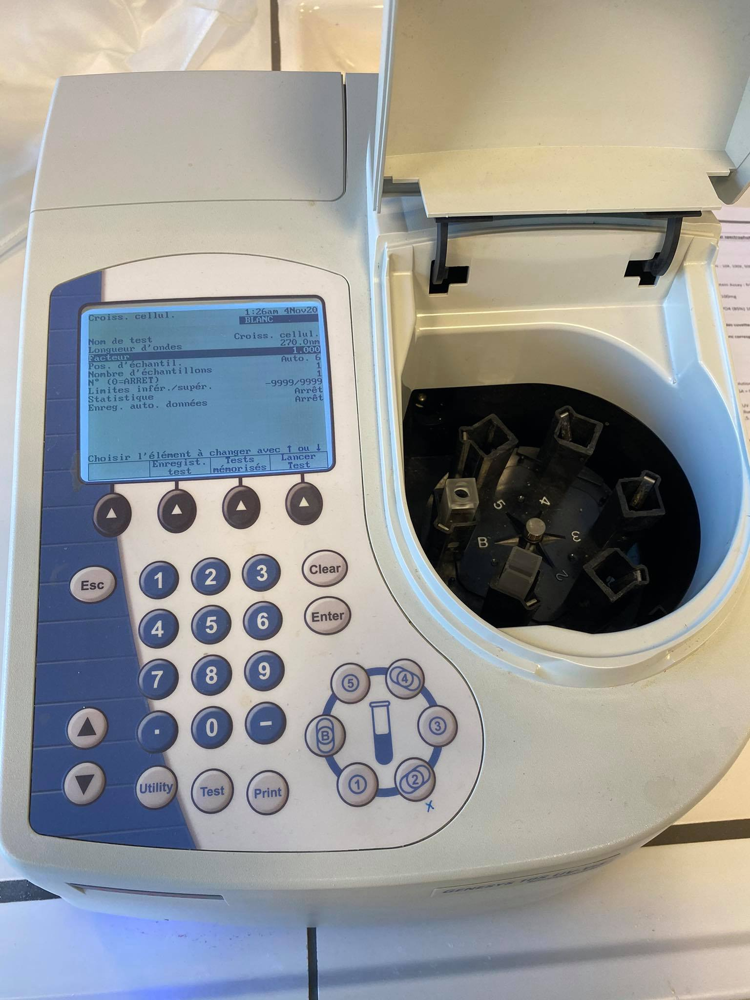
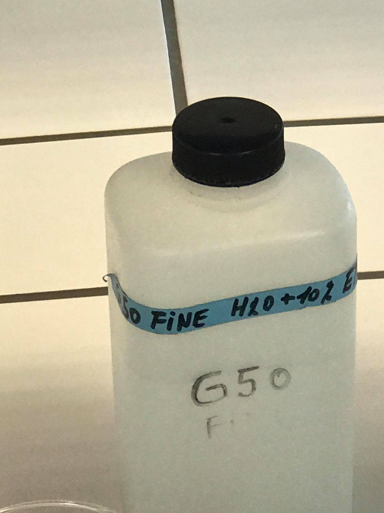
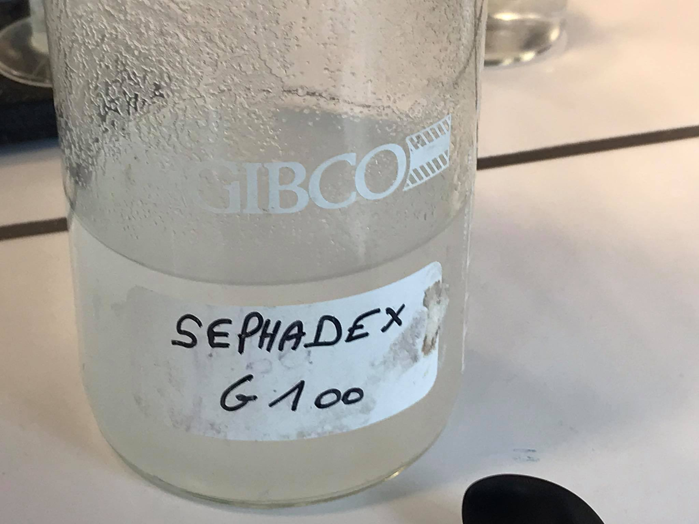
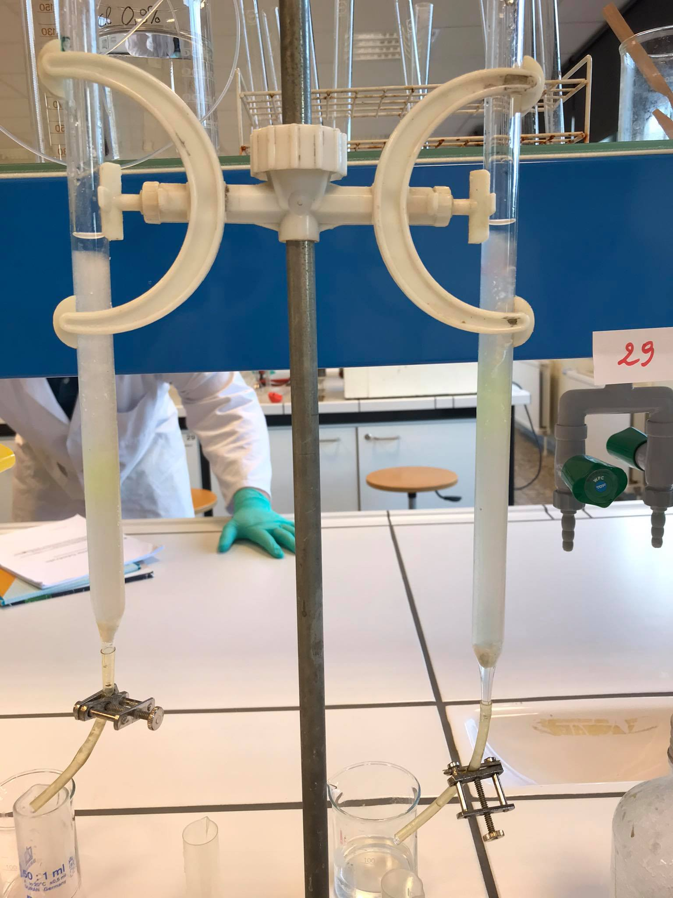
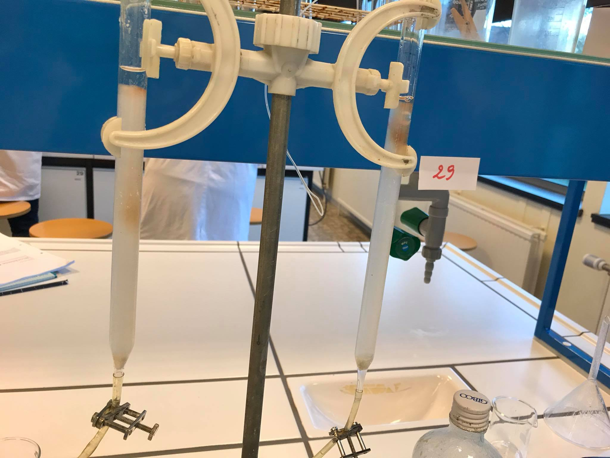
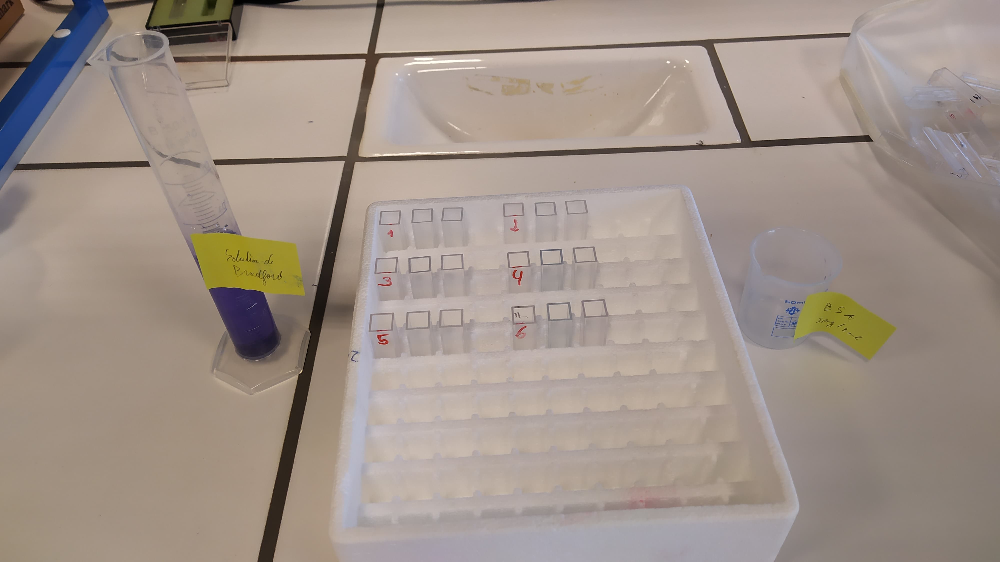

***
```{r setup, include=FALSE}
knitr::opts_chunk$set(echo = TRUE)
SciViews::R
library(dplyr)
library(ggridges)
library(knitr)
# Excel import packages
library(readxl)
```
  
# **Atelier 1:** Les Protéines
  
## Introduction
  
### Qu'est-ce qu'une protéine?
Une protéine est une macromolécule dont les monomères sont les acides aminés (aa). Les protéines sont les composés organiques les plus abondants dans les cellules: ils constituent plus de 50% de leur masse sèche. Elles sont directement codées à partir des gènes (transcription: 1 gène code pour une ou plusieurs protéines) et synthétisées par les ribosomes à partir d'acides aminés simples (traduction). Elles permettent le fonctionnement de toute cellule vivante. Le protéome constitue l'ensemble des protéines codées par le génome d'un individu. 
  
### Rôles des protéines
Qu'elles soient transportrices, hormonales, structurales, co-factrices, signalétiques, régulatrices, enzymatiques ou autres, les protéines forment un protéome de plus d'1 million de protéines. Ces protéines présentent différent niveaux de structuration: primaire, secondaire, tertiaire et quaternaire.
  
### Les niveaux de structuration
* **La structure primaire**: agencement covalent des acides aminés entre eux. L'ordre des acides aminés en partant de l'extrémité N-terminale vers l'extrémité C-terminale définit la nature de la protéine produite.
  
* **La structure secondaire**: conformations **localisées** et **répétées** le long de la chaîne polypeptidique.Elles sont de 3 types majeurs :les hélices alpha, les feuillets plissés bêta et les tournants bêta (+tonneaux bêta). Ces 4 exemples sont des **"motifs"** et l'association de motifs donnera ensuite des **"domaines"**, qui sont les unités structurales de la structure tertiaire. La fonction de la structure secondaire est de catalyser le reploiement tridimentionnel de la protéine par le biais des motifs qui s'assemblent en domaines, constituant ainsi de véritables noyaux de nucléation qui catalysent le folding de la chaîne d'aa. Les propriétés de ce niveau de structuration sont directement dues à la structure du lien peptidique (plan et polaire) et de son lien amide à entonoir structural. Ce niveau de structuration n'est stabilisé que par des liens hydrogène.
  
* **La structure tertiaire**: agencement des structures secondaires (domaines) dans l'espace tridimentionnel. Ce niveau de structuration n'est stabilisé que par des liens de faible énergie tels que:
  + Les interaction hydrophobes et hydrophiles (V.D.W.).
  + Les liens hydrogène.
  + Les interactions dipôles-charges0
  + Les liaisons ioniques.
  
Les boucles inter-domaines portent souvent l'activité de la protéine!
  
* **La structure quaternaire**: association dans l'espace tridimentionnel des différentes chaines polypeptidiques. Ce niveau de structuration optionnel n'est stabilisé que par des liens de faible énergie (voir structure tertiaire), MAIS il est rigidifié par liens disulfure S-S covalents (en dehors du milieu réducteur de la cellule). Ce niveau d'organisation apporte deux "avantages" majeurs:
  + **Présence de structures particulières:** cavités centrales (hémoglobine). Ces structures ont une forte relation structure-fonction et servent souvent à clusteriser un élément.
  + **Phénomène de coopérativité:** les sous-unités interagissent entre elles de telle sorte que la modification conformationnel de l'une d'entre elles engendre l'augmentation de l'efficacité des autres sous-unités. Si une protéine a une structure quaternaire (plus d'une sous-unité) et présente des propriétés de coopérativité, elle est dite **allostérique**.
  
### Dénaturation des protéines
Toutes ces structures sont stabilisées par des liasons de forte et de faible énergie. Il est bien évidemment possible de **dénaturer** (briser la structure de) la protéine en utilisant diverses méthodes:
  
* **Chaleur (ex: coagulation de l'albumine du blanc d'oeuf):** Vu que la structure d'une molécule est basée sur les interactions énergétiques de faible et de forte énergies, l'apport d'énergie au système va dérégler ce système de stabilisation énergétique et perturber les liens, ce qui engendrera la dénaturation de la protéine.
* **Rayons UV et radiations ionisantes.**
* **Solution d'urée ou de sels de guanidine:** Perturbe les liens hydrogènes. En effet, l'urée et la guanidine sont des chaotropes qui dénaturent la structure tertiaire des protéines en interagissant avec interaction de faible énerie. Dans ce cas-ci, l'urée est un agent rupteur de liaisons hydrogènes par excellence à cause de sa grande tendance à former des liens hydrogènes (6: 2N et 1O) (ce qui perturbe les liens hydrogènes stabilisant la protéine).
* **Variations de pH.**
* **Détergents:** perturbent les interaction hydrophobes.
* **Solvants organiques.**
* **Simple dilution ou agitation.**
  
### Absborbance des protéines dans le spectre lumineux (spectrophotométrie)
Comme établi précédemment, la liaison peptidique confère des propriétés fascinantes aux protéines. L'une d'entre elle est l'absorption importante aux longueurs d'onde à 230 nm (UVc). Certaines protéines possèdent néanmoins une absorption dans une gamme plus élevée 280 nm (UVb et c), que ce soit à cause de leur radical phényle/ol (Phénylalanine et Tyrosine) ou du noyau indole (Tryptophane).

Cette absorption est d'ailleur intimement liée aux procédés de spectrophotométrie, ainsi qu'à la loi de Beer Lambert.


  
## But de la manipulation
Cette manipulation est segmentée en deux parties:
  
* **La séparation par colonne de chromatographie:** cette partie a pour but de séparer 3 molécules (Blue dextran, Hémoglobine et Ferycianine de K) selon leur taille. Pour ce faire, on utilise un gel de dextrane à différent domaines de réticulation: le **Sephadex** (phase stationnaire), constamment hydraté par une solution de NaCl 0.9% (9g de NaCl pour 1L d'eau ≃ solution physiologique). Par élution des 3 molécules à travers deux types de Sephadex, nous pourrons les différencier selon leur taille grâce à leur vitesse de progression à travers les Sephadex mais aussi selon leur volume nécessaire pour être éluées.
  
* **La séparation par spectrophotométrie:** 
  + Dans un premier temps, nous analyserons l'absorption du rayonnement UV par les protéines (280 nm pour les aa aromatiques et 230 nm pour les lien peptidiques).La mesure d'absorption UV du BSA permettra de vérifier sa concentration protéique exacte (à l'aide de Beer-Lambert), et la suite de l'expérience permettra de confirmer que le pic d'absorption aux UV de protéines (albumine) du blanc d'oeuf est bien de 280 nm par la mesure des différentes solutions diluées (10X, 100X, 500X, 1000X).

  + Dans un second temps, nous nous pencherons sur la fixation non covalente de bleu de Coomassie (solution de Bradford), dont "l’interaction avec les groupements fonctionnels basiques et/ou aromatiques des protéines permet le passage de la forme cationique vers anionique (595 nm)"(L. Colignon, 2020, dia 13), ce qui nous permettra de calculer la concentration en protéines du blanc d'oeuf à partir d'une droite d'étalonnage au BSA préalablement établie.
  
## Matériel
### Séparation par colonne de chromatographie
* **NaCl 0.9% (1L):** phase liquide.
* **Sephadex G50 et G100:** phase solide.
* **Molécules analysées:**
  + Blue dextran 2000 (2 000 000Da) 2mg/ml (100ml).
  + Hémoglobine (65 000 Da) 5mg/ml (100ml).
  + Ferrycianide de potassium (329 Da) 2mg/ml (100ml).
* Verres à pied et béchers.
* Colonne de chromatographie (2), ouate, bouchon, tuyau, pipette pasteur.
  

  
### Séparation par spectrophotométrie
* **BSA 1g/l:** Albumine bvine (étalonnage)
* **NaCl 0,9%:** solvant physiologique pour analyse spectrophotométrique.
* **Blanc d’œufs** (différentes dilutions : 10X, 100X, 500X, 1000X)
  

  
* **Spectrophotomètre** + cuvettes en plastique et en quartz.
* **Solution de Bradford:**
  + Bleu de Coomassie G250 100mg
  + Ethanol 95% 50 ml
  + Acide phosphorique H3PO4 (85%) 100 ml
  + H2Od 1L
  

  
## Méthode 
### Séparation par colonne de chromatographie
Deux solution de Sephadex préalablement préparées furent mises à notre disposition: une G50 et une G100. Une solution supplémentaire de NaCl 0,9 % fut aussi réalisée afin de nous permettre d'hydrater constamment le Sephadex, qui a besoin d'une phase mobile liquide pour éluer les molécules. Un bécher hydratera constamment les deux colonnes goutte par goutte (vase communicants).




Ensuite, il fallut remplir 2 colonnes de verre à 3/4 de leur capacité avec le G50 pour l'une et le G100 pour l'autre. La sédimentation du séphadex étant nécessaire, nous avons laissé le robinet ouvert, pour ensuite retirer, à l'aide d'une pipette pasteur, l'excès de NaCl 0.9% surnageant le Sephadex pour n'en laisser qu'un milimètre. Après avoir refermé le robinet, nous avons délivré circulairement un volume de 150 µl de chaque molécule le long de la colonne en prenant gare à ne pas perturber la surface du gel.

  
La masse en dalton des différents composés est la suivante:
  
* **Blue dextran (2.000.000 Da)**. Note: ce composé devrait aller rapidement vers le bas de la colonne (plus lourd).
* **Hémoglobine (65.000 Da)**. Note: ce composé ira plus lentement.

* **Ferycianine de K (329 Da)**. Note: ce composé sera assez lent et restera probablement un moment dans le quart supérieur de la colonne de chromatographie.
  
L'ouverture du robinet permit ensuite la pénétration de la phase stationnaire (Sephadex) par les différentes molécules, tandis que la phase mobile (NaCl) était constamment renouvelée pour permettre l'élution des 3 composés. Au cours de l'élution, nous avons recueilli le tampon mélangé aux molécules dans un verre à pied afin de comparer les volumes d'élution des différentes molécules à travers le G50 et le G100.
  
Cette étape achevée, une courbe étalon fut élaborée sur excel, puis Rstudio à partir des données recueillies.
  
### Séparation par spectrophotométrie
Cette partie commença par la préparation des solutions suivantes:
  
* [1] **Une solution de BSA** (albumine bovine) 0.1%. Nous avons décidé de préparer 3 ml de solution avec 3 mg de BSA pour éviter toute erreur trop importante lors de la pesée.
  
* [2] **Une solution de NaCl 0.9%** (9g de Nacl dans 1L d'eau).
  
* [3] Quelques solutions de **blanc d’œuf dilué au NaCl 0.9%** (10x, 100x, 500x et 1000x).
  + Solution diluée 10x: 1ml de blanc d'oeuf que l'on porte à 10ml avec du NaCl 0,9%
  + Solution diluée 100X: 10µl de blanc d'oeuf (de départ), on ajoute 9,9ml de NaCl 0,9% pour 10ml
  + Solution diluée 500x: 20µl de blanc d'oeuf (de départ), on ajoute 9,98ml de NaCl 0,9%
  + Solution diluée 1000x: 10µl de blanc d'oeuf (de départ), on ajoute 9,99ml de NaCl 0,9%
  
* [4] **Une solution de Bradford.** La solution fut préparée à partir d'1,5 mL d'éthanol 96%, de 3 mg de bleu de Coomassie et de 3 mL d'acide phosphorique 85%, mis au trait à 30 mL dans un verre à pied. La solution fut ensuite diluée 5 fois (1:4) pour aboutir à un volume total de 150mL. Néanmoins, le bleu de Coomassie étant périmé, les deux manipulations utilisant la solution de Bradford furent soldées par un échec. Les données du groupe de **Ludivine Du Moulin** furent utilisées pour pallier à cette regrettable erreur.
  
**2 méthodes seront utilisées:** La méthode par *absorption UV* et la méthode de *Bradford*.

#### Absorption des UV
La mesure de l'absorbance de BSA [1] s'est faite à 280nm à l'aide de cuvettes en quartz (le plastique est peu adéquat car il absorbe dans l'UV). 
  
* **[Brad1] Mesure du BSA et vérification de la concentration (1mg/ml):** Cette étape permet de faire des calculs précis dans l'étalonnage de ssolutions de blancs d'oeuf en établissant la concentration du BSA comme référence.
  
* **[Brad2] Mesure de l'absorbance des solutions diluées de blancs d'oeuf:** L'analyse se poursuivit par l'établissement d'un spectre d'absorption des solution de blanc d'oeuf préparée préalablement [3]. La valeur initiale d'absorption était de 0.143 à 250 nm. (Quand bien même il était indiqué de diluer la solution pour atteindre une valeur comprise entre 0.2 et 0.5, Mme Colignon nous a autorisé à poursuivre avec cette valeur). Un test blanc a été effectué entre chaque changement de 10 nm de longueur d'onde.
  
#### Méthode de Bradford
Les solutions [1], [2], [3] et [4] furent utilisées dans cette partie.
  
Comme mentionné, les données du groupe de **Ludivine Du Moulin** furent utilisées pour pallier à la péremption de la solution de Bradford. Cepndant, dans **[Brad2]** la valeur de l'absorbance de l'albumine pour m = 11,5 µg est manquante (anormale apparemment), elle ne fut donc pas représentée dans le graphique pour éviter de le fausser. De plus, il semblerait que les données de référence de l'absorbance du blanc à chaque échantillon soient manquantes... N'ayant pas trouvé d'autres données pertinentes et proches des notres, nous allons contienuer avec ces valeurs et nous pallierons à tout imprévu de la meilleure manière possible.
  
##### Courbe d’étalonnage BSA à 595 nm (Brad1)
Pour cette partie, nous avons commencé par la réalisation de la droite d'étalonnage avec en ordonées l'absorbance de la solution de Bradford et en abscisse la concentration en BSA (calculée par la loi de Beer Lambert). Pour cela, nous avons disposé 18 tubes à essai dans une boîte en polystyrène (3 essais par échantillon - *voir figure 9*).
  

  
Nous avons pour cela pris 18 petits tubes à essais, numérotés en trois séries de 6, et le blanc.
  
Nous avons pipeté des concentrations en albumine différentes (voir tableaux résultats) et amené le volume de chaque cuvette à 100µl avec de l'eau distilée, pour ensuite finir par ajouter 4mL de solution de Bradford (2,5 mL dans notre échec, les solutions avaient été directement préparées dans les cuvettes). 
  
Après avoir attendu une dizaine de minutes, nous avons mesuré l’absorbance des échantillons à 595nm (cuvettes plastique) de chaque tube par rapport à un blanc (100 µL d'eau distilée et 4mL de colorant).
  
##### Concentration protéique des échantillons de blanc d’œuf (Brad2)
Après cela, nous avons réalisé le même test avec les solutions diluées de blanc d'oeuf afin de pouvoir déterminer leur concentration en protéine respectives. 8 cuvettes furent remplies par 100µL de dilution de blanc d'oeufs et 4 mL de colorant. 2 cuvettes furent utilisées comme blanc (NaCl 0.9% + 4mL de colorant Bradford).
  

  
Les cuvettes plastiques furent ensuite passées au spectrophotomètre de masse à 595nm par rapport à un blanc de NaCl.
  
La concentration en albumine sera déterminée grâce à la courbe d'étalonnage précédemment établie.
  
## Résultats et Discussion
  
### Absorption des UV
  
#### Mesure du BSA et vérification de la concentration (1mg/ml)
  
##### Résultats BSA
La mesure d'absorbance de la solution de BSA donna le résultat suivant: A = 0.673.
  
##### Discussion BSA
Selon Beer-Lambert: 
  
A = ε.L.C (avec **A= 0.673**, ε = 0.66, L = 1)
  
**C = 1.02 g/l** La concentration de 1 mg/ml est donc vérifiée par spectrophotométrie. 
  
Cependant, la valeur utilisée dans les expériences impliquant la solution de Bradford sera de 1.15 mg/ml (péremption du Bleu de Coomasie).
  
#### Mesure de l'absorbance des solutions diluées de blancs d'oeuf
  
##### Résultats sous forme de tableau de données
```{r}
# Import dataframe
UV1 <- read_excel("~/shared/projects/TP-Bioch-BAB2-Q1/Excel/UV1.xlsx")
  
# Labelise + kable
UV1 %>.%
  labelise(UV1, self = FALSE,
    label = list(
      LDO = "Longueur d'onde",
      DOx100 = "Absorbance de la solution diluée x100"),
    units = list(
      LDO = "nm",
      DOx100 = NA))
  
# Kable options
options(knitr.table.format = NULL)
  
knitr::kable(., col.names = c("Longueur d'onde (nm)", "Absorbance de la solution diluée x100"), align = "cc")
```
  
##### Discussion et Courbe d'étalonnage
```{r}
chart(UV1, DOx100 ~ LDO) +
  geom_point(na.rm = T) +
  geom_smooth(method = NULL, se = F, span = 0.4, na.rm = TRUE, aes(colour = "hehee boii"), show.legend = FALSE) +
  labs(y = "Absorbance de la solution diluée x100", x = "Longueur d'onde (nm)", title = "Mesure de l'absorbance du blanc d'oeuf dilué x100") +
  scale_fill_viridis_d() +
  geom_vline(xintercept = 280)
```
Nous avons donc établi cette courbe sur base des données recueillies durant les mesures spectrophotométriques. Les valeurs au delà de 300 nm étaient parfois négatives, elles furent arrondies à 0 pour éviter tout problème au niveau du graphe. On observe un pic assez évident à 280 nm (ligne noire). Cette hausse d'absorbance est due à la présence probable d'acide aminé avec des radicaux phényle/ol (Phénylalanine et Tyrosine) ou des noyaux indole (Tryptophane). 
  
**Analyse annexe par curiosité:**
  
Selon les travaux de W. H. Stein et S. Moore (1948), voici la composition en résidus acide aminés pour 100g de BSA:
```{r}
# IImport DF
BSA_amino <- read_excel("~/shared/projects/TP-Bioch-BAB2-Q1/Excel/BSA_amino.xlsx")

# Kable
options(knitr.table.format = NULL)
  
knitr::kable(BSA_amino, col.names = c("Acides aminés", "Masse (g) des résidus d'aa pour 100 g de BSA"), align = "cc")
```
Nous avons rajouté 3 colonnes à ce tableau:
* **[1]**: La masse totale d'aa absorbant à 280 (Tryptophane,Phénylalanine et Tyrosine) -> 10.96.
* **[2]**: La masse totale tout résidus confondus -> 97.89.
* **[3]**: Le ratio [2]/[1] -> 9% d'aa absorbant à 280 nm.
  
Nous pouvons essayer par curiosité de pousser l'analyse encore plus loin.Le blanc d'oeuf étant composé à 54% d'ovalbumine (forme d'albumine animale) (Takehiko, Y. et Mujo, K. (1996)), les données liées au BSA permettent de donner la composition en aa approximative de notre échantillon et d'estimer qu'il y avait ±9% d'aa absorbant à 280 nm.
  
Cette analyse supplémentaire est purement facultative et motivée par notre curiosité, mais elle permet l'ouverture des résultats à la lumière d'expériences externes.
  
### Méthode de Bradford
  
##### Courbe d’étalonnage BSA à 595 nm (Brad1)
  
###### Résultats sous forme de tableau de données:
```{r}
# Import dataframe
brad1 <- read_excel("~/shared/projects/TP-Bioch-BAB2-Q1/Excel/brad1.xlsx")
# Labelise + kable
brad1 %>.%
  labelise(brad1, self = FALSE,
    label = list(
      tube = "Tube n°",
      alb = "Albumine à 1,15 mg/ml (µl)",
      eau = "Eau distillée (µl)",
      col = "Colorant Bradford (ml)",
      calb = "Concentration finale d'albumine (mg/ml)",
      mass = "Masse Albumine (µg)",
      DO = "D.O. à 595 nm",
      DO_moy = "D.O. moyenne"),
    units = list(
      tube = NA,
      alb = "µl",
      eau = "µl",
      col = "ml",
      calb = "mg/ml",
      mass = "µg",
      DO = NA,
      DO_moy = NA))
  
# Kable options
options(knitr.table.format = NULL)
  
knitr::kable(., col.names = c("Tube n°", "Albumine à 1,15 mg/ml (µl)", "Eau distillée (µl)", "Colorant Bradford (ml)", "Concentration finale d'albumine (mg/ml)", "Masse Albumine (µg)", "D.O. à 595 nm", "D.O. moyenne"), align = "cccccccc")
```
###### Discussion et Courbe d'étalonnage
```{r}
# Purification DF
brad1 %>.%
  filter(., tube %in% c("1", "3", "4", "5", "6")) %>.%
  select(., c(calb,DO_moy)) -> brad1P
  
# Tableau Brad1 Purifié (Brad1P)
knitr::kable(brad1P, col.names = c("Concentration protéique finale (mg/ml)", "Absorbance moyenne"), align = "cc")
  
# Graph
chart(brad1P, DO_moy ~ calb) +
  geom_point(na.rm = TRUE) +
  geom_smooth(method = 'lm', se = FALSE, na.rm = TRUE, colour = "red") +
  labs(x = "Concentration protéique finale (mg/ml)", y = "Absorbance moyenne à 595 nm", title = "Courbe d'étalonnage de l'absorbance des solutions diluées de blanc d'oeuf")
  
# Equation of linear regression
courbe_etal <- lm(data = brad1P, DO_moy ~ calb) # Formule de la regression linéaire
coef_etal <- coef(courbe_etal) # Coefficient de la pente
print(courbe_etal)
```
  
Voici donc la droite d'étalonnage qui va nous permettre de déterminer les concentrations protéiques dans la section suivante (Brad2). Comme mentionné précédemment, la valeur de l'absorbance de l'albumine pour m = 11,5 µg est manquante dans le jeu de donnée récupéré. L'équation de la droite de régression est la suivante: y = ax + b avec a = ±0.66 (pente= absorbance/Concentration protéique), b = ±0, y = Absorbance, x = Concentration d'albumine.
  
-> **Formule:** Absorbance = 0.66 * Concentration protéique
  
##### Concentration protéique des échantillons de blanc d’œuf (Brad2)

###### Résultats sous forme de tableau de données
```{r}
# Import dataframe
brad2 <- read_excel("~/shared/projects/TP-Bioch-BAB2-Q1/Excel/brad2.xlsx")
# Labeling
brad2 %>.%
  labelise(brad2, self = FALSE,
    label = list(
      tube = "Tube n°",
      bdo = "Blanc d’œuf dilué (µl)",
      nacl = "NaCl 0,9% (µl)",
      col = "Colorant Bradford (ml)",
      DO = "D.O. à 595 nm",
      DO_moy = "D.O. moyenne",
      mprot = "Masse protéique (µg)",
      cprot = "Concentration protéique (mg/ml)"),
    units = list(
      tube = NA,
      bdo = "µl",
      nacl = "µl",
      col = "ml",
      DO = NA,
      DO_moy = NA,
      mprot = "µg",
      cprot = "mg/ml",
      tube = NA))
  select(., - c(mprot, cprot)) -> brad2P
  
# Kable options
options(knitr.table.format = NULL)
  
knitr::kable(brad2P, col.names = c("Tube n°", "Blanc d’œuf dilué (µl)", "NaCl 0,9% (µl)", "Colorant Bradford (ml)", "D.O. à 595 nm", "D.O. moyenne"), align = "cccccc")
```
  
###### Discussion et calcul des concentrations protéiques
```{r}
brad2 %>.%
  filter(., tube %in% c("Blanc", "10X", "100X", "500X", "1000X")) %>.%
  select(., c(tube, DO_moy)) %>.%
  mutate(., cprot2 = round(DO_moy / 0.66, digits = 2)) -> brad2T

knitr::kable(brad2T, col.names = c("Tube n°", "D.O. moyenne", "Concentration protéique (mg/ml)"), align = "cccc")
```
  
En utilisant la droite d'étalonnage [Brad1], on peut facilement calculer les concentrations protéiques des différentes dilutions de blanc d'oeuf.
  
**Formule:** Concentration protéique = Absorbance / 0.66 [Brad1]
  
* 10X: Concentration protéique = 0. / 0.66 = 1.43 mg/ml
* 100X: Concentration protéique = Absorbance / 0.66 = 1.15 mg/ml
* 500X: Concentration protéique = Absorbance / 0.66 = 0.49 mg/ml
* 1000X: Concentration protéique = Absorbance / 0.66 = 0.30 mg/ml
  
On voit clairement que plus le blanc d'œuf est dilué, plus la concentration protéique diminue.
  
**Analyse annexe par curiosité:**
  
Pour vérifier la probabilité de ce résultat, une approximation grossière peut être faite. Sachant que, selon le manuel international de pasteurisation de l'oeuf (G. W. Froning et al., 2002), le blanc de l'oeuf contient 10.52g pour 100g de blanc (Voir Table 1, page 3), et que selon Romanoff et al. (1949), "Density of whole egg, white and yolk is 1.035 [g/cm^3] at room temperature", on peut estimer que -Volume total de blanc = masse de blanc / densité du blanc- va donner Vblanc = 96.62 ml de blanc contenant 10.52 g de protéines. 
  
Cela nous donne un total de 108,8 mg/ml. 
  
Bien que ce résultat soit éloigné de notre valeur, il faut garder en tête que le le blanc d'oeuf, selon Takehiko, Y. et Mujo, K. (1996), est constitué de:
  
* 54% d'ovalbumine
* 12% d'ovotransferrine
* 11% Ovomucoide
* 4% Ovoglobuline
* 4% Ovoglobuline
* 3.5% Ovomucine
* 3.4% Lysozyme
* 1.5% Ovoinhibiteurs
* 1% Ovoglycoprotéines
* 0.8% Flavoprotéines
* 0.5% Ovomacroglobulines
* 0.05% Avidine
* 0.05% Cystatine
  
Le résultat de nos analyses fut obtenu par étalonnage au BSA, dont la composition est assez différente quoique semblable. Aussi, les dilutions, les erreurs humaines et d'autres facteurs comme la provenance de l'oeuf influent beaucoup. Cette approximation fut donc purement réalisée à titre d'analyse, mais ne remet probablement pas en cause le résultat.
  
#### Séparation de molécules par colonne de chromatographie
Voici les données récupérées par le groupe de **Bastien De Tandt**, notre chromatographie ayant donné des résultats moins visibles et moins concluants:
  
```{r Chroma import}
# Import dataframe
Chroma <- read_excel("~/shared/projects/TP-Bioch-BAB2-Q1/Excel/Chroma.xlsx")

Chroma
# Labeling
Chroma %>.%
  labelise(Chroma, self = FALSE,
    label = list(
      Molécules = "Molécules",
      MMprot = "Masse molaire des molécules (Da)",
      veluG50 = "Volume d'élution des molécules dans le G50 (ml)",
      veluG100 = "Volume d'élution des molécules dans le G100 (ml)"),
    units = list(
      Molécules = NA,
      MMprot = "Da",
      veluG50 = "ml",
      veluG100 = "ml")) -> ChromaP
  
# Kable options
options(knitr.table.format = NULL)
  
knitr::kable(ChromaP, col.names = c("Molécules", "Masse molaire des molécules (Da)", "Volume d'élution des molécules dans le G50 (ml)", "Volume d'élution des molécules dans le G100 (ml)"), align = "cccc")
```

##### Courbe d'étalonnage de Séphadex G100
```{r Chroma GrapheG100}
# Build graph
chart(ChromaP, veluG100 ~ MMprot) +
  geom_point(na.rm = TRUE, aes(color = Molécules)) +
  geom_line() +
  scale_x_continuous(trans = 'log2') +
  labs(x = "Logarithme de la Masse Moléculaire (log(Da))", y = "Volume d'élution (mL)", title = "Courbe d'étalonnage du Séphadex G100", fill = "Molécules") +
  scale_fill_viridis_d()
```
  
##### Courbe d'étalonnage de Séphadex G50
```{r Chroma GrapheG50}
# Build graph
chart(ChromaP, veluG50 ~ MMprot) +
  geom_point(na.rm = TRUE, aes(color = Molécules)) +
  geom_line() +
  scale_x_continuous(trans = 'log2') +
  labs(x = "Logarithme de la Masse Moléculaire [log(Da)]", y = "Volume d'élution [mL]", title = "Courbe d'étalonnage du Séphadex G50") +
  scale_fill_viridis_d()
```
  
##### Discussion des résultats de la séparation par colonne de chromatographie
La séparation des molécules se fait par rapport à leur masse moléculaire (Daltons) selon le domaine de rétulation des Séphadex (domaine de filtration).
  
Le domaine de réticulation (fractionnement) du Séphadex G50 est compris entre 1500 Da et 30 000 Da, tandis que le celui du G100 est compris entre 4000Da et 100 000 Da.
  
Le volume mort est le volume nécessaire pour permettre l'écoulement de toutes les molécules ayant une masse supérieure à la limite supérieure du domaine de réticulation du Sephadex.
  
Le volume d'élution est le volume nécessaire pour permettre l'écoulement de toutes les molécules ayant une masse comprise ou inférieure à la limite supérieure du domaine de réticulation du Sephadex.
  
* **Blue Dextran:** Vu que sa masse moléculaire (2 000 000 Da) est supérieure à la limite supérieure des domaines de réticulation des deux Sephadex, le volume récupéré dans les verres à pied est donc dans les deux cas le volume mort.
  
* **Hémoglobine:** Vu que sa masse moléculaire (65 000 Da) est supérieure à la limite supérieure du domaine de réticulation du Séphadex G50 mais comprise dans le domaine du G100, le volume récupéré dans le verre à pied sous le G50 est donc dans le volume mort (± égal au volume mort du bleu dextran). Celui récupéré dans le G100 est le volume d'élution. Le volume d'élution est toujours supérieur au volume mort.

* **Ferrycianide de potassium:** Vu que sa masse moléculaire (329 Da) est inférieure à la limite inférieure des domaines de réticulation des deux Sephadex, le volume récupéré dans les verres à pied est donc dans les deux cas le volume d'élution. Ce volume est plus grand car les molécules de Ferrycianide de potassium étant les moins massives, elles sont les dernières à sortir de la colonne de chromatographie.
  
__En résumé:__
  
* **G50:** Volume mort = ±10 mL et Volume d'élution = ±20.5 mL.
  
* **G100:** Volume mort = ±8.5 mL et Volume d'élution = ±15.5 mL.

__Analyse du graphique:__
  
Les courbes d'étalonnages sont globalement décroissantes. Cependant, nous pouvons constater que, à partir d'une certaine masse molaire moléculaire, nous obtenons un volume plus ou moins constant. Il correspond au volume mort.
  
### Conclusions
  
#### Absorption des UV
Après avoir vérifié la concentration du BSA (1.02 mg/ml), nous avons établi avec succès un spectre d'absorption dans l'UV de la solution de blanc d'oeuf x100. Ce spectre a démontré que l'échantillon contenait une quantité non-négligeable d'aa absorbant à 280 (Tryptophane,Phénylalanine et Tyrosine)
  
#### Méthode de Bradford
  
La droite d'étalonnage nous a permis de déterminer les concentrations protéiques des différentes dilution de blanc d'oeuf via la formule suivante:
  
**Formule:** Absorbance = 0.66 * Concentration protéique **ou** Concentration protéique = Absorbance / 0.66.
  
Voici les résultats de l'étape de détermination de la concentration en protéines du blanc d’œuf:
* 10X: 1.43 mg/ml
* 100X: 1.15 mg/ml
* 500X: 0.49 mg/ml
* 1000X: 0.30 mg/ml
  
La concentration protéique diminue au fur et à mesure de la dilution des échantillons. Nous avons donc réussi à déterminer la concentration protéique inconnue des solution de blanc d'oeuf dilué à partir d'une droite d'étalonnage réalisée à partir d'une concentration connue de BSA. 
  
#### Séparation de molécules par colonne de chromatographie
Suite à l'établissement des courbes d'étalonnage, nous avons pu conclure que pour toute molécule dont la masse molaire moléculaire est supérieure au domaine de réticulation du Séphadex, on aura toujours un volume d'élution relativement égal au volume mort. Si la masse molaire moléculaire est inférieure à la limite supérieure du domaine de réticulation, alors le volume requis pour éluer cette molécule sera d'autant plus grand que la molécule a une petite masse molaire. Vu qu'on travaille avec plusieurs molécules, le volume d'élution sera le volume qui aura fait passer la plus petite molécule.
  
* **G50:** Volume mort = ±10 mL et Volume d'élution max = ±20.5 mL.
  
* **G100:** Volume mort = ±8.5 mL et Volume d'élution max= ±15.5 mL.
  
Cette expérience nous a permis d'établir les droites d'étalonnage des deux Séphadex à notre disposition, et d'ainsi établir leur volumes morts et d'élution. Les 3 molécules ont correctement été différenciées selon leur masse molaire.
  
### Bibliographie
  
* Colignon, L. (2020). Travaux pratiques de biochimie 2020-2021, protocole Moodle, diapositive 13.
  
* Froning, G. W. et al. (2002). INTERNATIONAL EGG PASTEURIZATION MANUAL. Consulté à l'adress URL:<https://www.aeb.org/images/Pasteurization_Manual.pdf>. 
  
* Gillan, D. (2018?). Biologie Générale fascicule 1 et 4, Syllabus didpensé par l'Umons, pages diverses.

* Romanoff, A. L. and A. J. Romanoff. (1949). The Avian Egg. Wiley and Sons, New York.
  
* W.H.Stein et S.Moore (1948). AMINO ACID COMPOSITION OF β-LACTOGLOBULIN AND BOVINE SERUM ALBUMIN. Consulté à l’adresse URL:<https://www.jbc.org/content/178/1/79.full.pdf>.

* Takehiko, Y. et Mujo, K. (1996). Hen eggs, ISBN 9780849340055.


