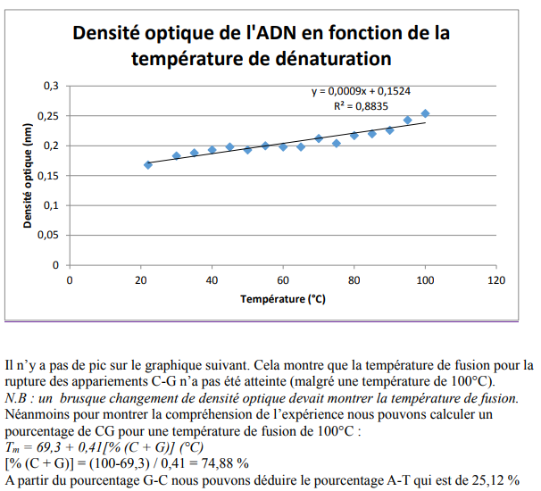

```{r setup, include=FALSE}
knitr::opts_chunk$set(echo = TRUE)
```

## **Atelier 2:** L'ADN

### Introduction

#### Les acides nucléiques
Les acides nucléiques sont des polynucléotiques. On les retrouve dans toutes les cellules vivantes ainsi que les virus, libres ou associés à des protéines (histones par ex). Ils sont le support de l'information génétique ou les agents permettant l'expression de cette information.

#### Les nucléotides
Monomères des acides nucléiques, les nucléotides n'ont PAS de rôle génétique. Ils jouent néanmoins un rôle dans le stockage de l'énergie (ATP/ADP et autres) ou en tant que coenzymes (NAD+, FAD, etc).
  
Un nucléotide peut être hydrolysé en 3 constituants:
* Une base hétérocyclique azotée (ATCG)
* Un sucre à 5 carbones (ribose pour ARN/désoxyribose pour ADN)
* Un acide phosphorique

#### Qu'est-ce que c'est l'ADN?
Chez les eucaryotes, l’ADN se retrouve dans le noyau cellulaire tandis que chez les procaryotes il est libre dans la cellule. Les quatre bases principales de l’ADN sont l’adénine, la thymine, la cytosine et la guanine. Ces bases s’apparient s’enroulent autour d’histones pour former 2 brins complémentaires qui vont être stabilisés par des liaisons hydrogènes pour donner la double hélice. Les liaisons entre les bases sont spécifiques, l’adénine avec la thymine par l’intermédiaire de 2 ponts d’hydrogènes, et la guanine avec la cytosine par 3 ponts d’hydrogène.
  
### But
Extraire et précipiter l'ADN contenue dans du thymus de veau (riche en ADN dû à la synthèse protéique importante). Ensuite dénaturer l’ADN afin de mesurer la densité optique, pour déterminer la composition en bases azotées AT et CG.
Remarques: Pendant les manipulations d’extraction, il faut faire attention à ne pas altérer l’ADN: éviter les pH extrêmes, les températures élevées, les faibles forces ioniques.
  
### Matériel
#### Extraction et précipitation
* Thymus de Veau (10g)
* Centrifugeuse + tubes à centrifuger
* 40 mL tampon glacé: NaCl 0.9% + Citrate de Na 0.01M
* 200 mL NaCl 0.09% glacé
* Verrerie diverse (béchers, erlenmeyers, pipettes et verres à pied, étamines, baguettes en verre)
* 18 mL de SDS-éthanol (5%-45%)
* 200 mL alcool dénaturé
* NaCl solide
  
#### Dénaturation
* Spectromètre + cuvettes en quartz
* Plaque chauffante
  
### Méthodes

#### Extraction et précipitation
Nous avons coupé 10g de thymus de veau pour mixer avec un tampon glacé (NaCl 0.9% et citrate de sodium 0.1M). Ensuite une centrifugation à froid à 5000t/min pendant 10 min est réalisée. Dès que le temps est écoulé le culot est récupéré et on y ajoute 40ml du tampon glacé, ce processus est par la suite renouvelé deux fois. Ces étapes permettent la séparation des cellules des autres tissus du thymus. Le culot final est homogénéisé pendant 3min dans un récipient de 200ml de NaCl 0.9% glacé pour récupérer les protéines présentes dans les cellules. Après il a fallu le déposer sur l’agitateur magnétique pendant 1h avec une solution de 18ml de SDS 5% pour détruire les membranes biologiques (cellulaires et nucléaires). Nous avons rajouté 13g de NaCl solide et pendant 10 min celui-ci a été agité ce qui permet de séparer les histones des bases nucléiques, le précipité est prélevée après un filtrage sur étamine. Ensuite, 200 ml d’alcool dénaturé sont ajoutés et mélangés pour précipiter l’ADN. Pour finir nous l’avons remis dans une solution de 100ml de tampon glacé fait en début de manipulation, ce qui évite toute modification de sa structure. 

####  Dénaturation de l’ADN purifié
Nous avons chauffé la solution à 80° pour dénaturer l’ADN et que celui-ci se retrouve sous forme de monobrins. Ensuite un filtrage a été réalisé pour enlever les impuretés, et il a été refroidit par la suite pour reformer la double hélice d’ADN. Le filtrat refroidit a été chauffé sur une plaque électrique. Et à chaque augmentation de 5°, une mesure sur la densité optique a été prélevée grâce au spectromètre à UV (cuvettes en quartz). Les appariements C-G possèdent 3 liaisons hydrogènes, tandis que les appariements A-T en possèdent 2, une température de fusion plus importante va être nécessaire pour briser les C-G du à lors stabilité plus importante.
  
### Résultats

  
### Discussion

  
### Conclusion


### Bibliographie


