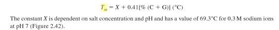

***
```{r setup, include=FALSE}
knitr::opts_chunk$set(echo = TRUE)
SciViews::R
library(dplyr)
library(ggridges)
library(knitr)
# Excel import packages
library(readxl)
```

## **Atelier 2:** L'ADN
  
### Introduction
  
#### Les acides nucléiques
Les acides nucléiques sont des polynucléotiques. On les retrouve dans toutes les cellules vivantes ainsi que les virus, libres ou associés à des protéines (histones par ex). Ils sont le support de l'information génétique ou les agents permettant l'expression de cette information.
  
#### Les nucléotides
Monomères des acides nucléiques, les nucléotides n'ont PAS de rôle génétique. Ils jouent néanmoins un rôle dans le stockage de l'énergie (ATP/ADP et autres) ou en tant que coenzymes (NAD+, FAD, etc).
  
Un nucléotide peut être hydrolysé en 3 constituants:
  
* Une base hétérocyclique azotée (ATCG).
* Un sucre à 5 carbones (ribose pour ARN/désoxyribose pour ADN).
* Un acide phosphorique.
  
#### Qu'est-ce que c'est l'ADN?
Chez les eucaryotes, l’ADN se retrouve dans le noyau cellulaire tandis que chez les procaryotes il est libre dans la cellule. Les quatre bases principales de l’ADN sont l’adénine, la thymine, la cytosine et la guanine. Ces bases s’apparient s’enroulent autour d’histones pour former 2 brins complémentaires qui vont être stabilisés par des liaisons hydrogènes pour donner la double hélice. Les liaisons entre les bases sont spécifiques, l’adénine avec la thymine par l’intermédiaire de 2 ponts d’hydrogènes, et la guanine avec la cytosine par 3 ponts d’hydrogène.

#### Hypothèses d'Edwin Chargaff
Les analyses d'ADN d'Edwin Chargaff montrent qu'il y a autant d'adénine (A) que de thymine (T). De même, il y a autant de guanine (G) que de cytosine (C).
  
* A/T = 1 et G/C = 1
* A + G = C + T
  
Par ailleurs, la composition en bases azotées peut être quantifiée par la formule suivante:

  
Les bases azotées de l'ADN sont liées entre elles par des liaisons hydrogènes au sein de la double hélice. Les guanines sont triplement liées aux cytosines, tandis que les thymines sont doublement liées aux adénines. Un échantillon dénaturé par la chaleur comportera plus de GC que de AT dû. En effet, une température de fusion plus importante va être nécessaire pour briser les liaisons C-G du à leur stabilité plus importante (une liaison H en plus).
  
### But
Extraire et précipiter l'ADN contenu dans du thymus de veau (riche en ADN dû à la synthèse protéique importante). Ensuite dénaturer l’ADN afin de mesurer la densité optique, pour déterminer la composition en bases azotées AT et CG.
  
Remarque: Pendant les manipulations d’extraction, il faut faire attention à ne pas altérer l’ADN: éviter les pH extrêmes, les températures élevées et les faibles forces ioniques.
  
### Matériel
#### Extraction et précipitation
* Thymus de veau (10g).
* Centrifugeuse + tubes à centrifuger.
* 40 mL tampon glacé: NaCl 0.9% + Citrate de Na 0.01M.
* 200 mL NaCl 0.09% glacé.
* Verrerie diverse (béchers, erlenmeyers, pipettes et verres à pied, étamines, baguettes en verre).
* 18 mL de SDS-éthanol (5%-45%).
* 200 mL alcool dénaturé.
* NaCl solide.
  
#### Dénaturation
* Spectromètre + cuvettes en quartz.
* Plaque chauffante.
  
### Méthodes
#### Préparation des solutions
* **[1] Le tampon:** dans un matras de 500ml.
  + **Nacl:** 4.5 g de NaCl solide.
  + **Citrate de Na:** 1.47 g de Citrate de Na solide.
  

  
* **[2] NaCl 0.09%:** 0.45g dans un matras de 500 mL.
  

  
* **[3] SDS 5% - Ethanol 45%:** dans un matras de 50 mL.
  + **SDS:** 2,5 g de SDS solide.
  + **Ethanol** 22,5 ml de Ethanol à 100%.
  

  
#### Extraction et précipitation
La première étape de cette expérience était de prélever 10g de thymus de veau (figure 3) pour ensuite le mixer avec un tampon glacé. 750ml de tampon furent donc préparés préalablement à partir de 6,75g NaCl 0.9% et 2,205g citrate de sodium 0.1M (mis au trait avec de l'eau distiliée)/
  


S'ensuit une centrifugation (figure 5) à froid à 5000t/ durant 10 minutes. Après ce délai, le culot fut récupéré pour y incorporer 40 mL de tampon glacé, processus qui sera réitéré à deux reprises. Ces étapes intermédiaires permettent une séparation efficace des cellules incluses au sein des tissus du thymus. Le culot final fut incorporé dans un erlenmeyer de 200 mL de NaCl 0.09% glacé, ce qui permit de récupérer les protéines présentes dans les cellules. La préparation fut ensuite transvasée dans un bécher, et après y avoir ajouté 18 mL de SDS+éthanol, ce bécher fut déposé sur l'agitateur magnétique pendant 1h afin de détruire les membranes biologiques (cellulaires et nucléaires).(figure 6)
  

  

  
Nous avons ensuite rajouté 13g de NaCl solide dans le bécher. Une agitation constante de la mixture pendant 10 min permit de séparer les histones des bases nucléiques, précipité qui fut prélevé grâce à un filtrage sur étamine(figure 7). Par la suite, 200 ml d’alcool dénaturé (éthanol 100%) furent ajoutés et mélangés à l'aide d'une baguette de verre pour faire précipiter l’ADN. (figure 8) 
  

  

Enfin, l'ADN fut transvasé dans une solution de 100ml de tampon glacé pour éviter toute modification de sa structure.
  
####  Dénaturation de l’ADN purifié
Comme précédemment expliqué dans l'introduction, il existe plusieurs moyens de dénaturer l'ADN. Celui que nous utiliserons aujourd'hui sera la **chaleur**.
  
Les étapes qui suivent consisteront en une alternance entre la chauffe de la solution et la mesure de sa Densité Optique à 260 nm (cuvettes en quartz pour UV car le plastique absorbe l'UV). La première mesure se fait à température ambiante car l'ADN est encore sous forme de double brins non dénaturés. La solution d'ADN doit cependant avoir une DO unitiale située entre 0.2 et 0.3 (0.221 dans notre cas). La solution fut ensuite placée sur plaque chauffante et sa densité optique fut mesurée tous les 5°C jusque 100°C. 
  
  

  
### Résultats
Voici les données recueillies lors de la dernière étape de la manipulation:
  
```{r ADN import}
# Import dataframe
ADN <- read_excel("~/shared/projects/TP-Bioch-BAB2-Q1/Excel/ADN.xlsx")

# Kable options
options(knitr.table.format = NULL)
  
knitr::kable(ADN, col.names = c("Température [°C]", "Absorbance"), align = "cc")
```
  
Les données à 46°C et 66°C semblent être des artéfacts. Mettons ces données en graphique.
  
```{r ADN graphe}
# Build graph
chart(ADN, Absorbance ~ Température) +
  geom_point(na.rm = T) +
  geom_smooth(method = NULL, se = F, span = 2, na.rm = TRUE, aes(colour = "hehee boii"), show.legend = FALSE) +
  scale_x_continuous(trans = 'log2') +
  labs(x = "Température [°C]", y = "Absorbance", title = "Analyse optique de la dénaturation de l'ADN par la chaleur") +
  scale_fill_viridis_d()
```
  
### Discussion
Un brusque changement de densité optique devait montrer la température de fusion. La température de fusion Tm semble être d'environ 80°C (là où la courbe devient plus raide). Nous pouvons utiliser cette donnée dans le calcul suivant:
  

  
80 = 69.3 + 0.41(%C+G)
  
(80 - 69.3)/0.41 = (%C+G)
  
(%C+G) = 26.1%
  
Le pourcentage d' A+T est donc de 73.9%.
  
### Conclusion
Nous avons établi avec succès le pourcentage d'A+T (73.9%) et de C+G (26.1%) dans l'ADN contenu dans 10g de thymus de veau. 

### Bibliographie
  
* Colignon, L. (2020). Travaux pratiques de biochimie 2020-2021, protocole Moodle.
  
* Gillan, D. (2018?). Biologie Générale fascicule 1 et 4, Syllabus didpensé par l'Umons, pages diverses.
