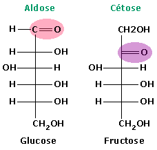
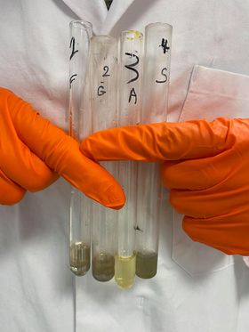

***
```{r setup, include=FALSE}
knitr::opts_chunk$set(echo = TRUE)
SciViews::R
library(dplyr)
library(ggridges)
library(knitr)
# Excel import packages
library(readxl)
```

## **Atelier 3:** Les sucres

### Introduction
  
#### Qu'est-ce qu'un sucre?
Les glucides (carbohydrates, sucres, -oses, hydrates de carbone), sont une classe de macromolécules dont la formule chimique correspond à ce modèle: Cn(H2O)p. 
Constituants essentiels à la survie des êtres vivants, ils accomplissent des fonctions allant de la structuration cellulaire à la mise en réserve.
Ce sont des constituants essentiels des êtres vivants et de leur mode de nutrition. Cependant, ils ne remplissent jamais un rôle informationnel. Les monomères constituant l'unité de base des glucides sont les monosaccharides.
  
#### Les monosaccharides
Les sucres sont donc des poly-alcools dont les unités fonctionnelles sont les groupements carbonyles et hydroxyles. Si le carbonyle est terminale, on parlera d'**aldoses**. Si par contre il est intégré à l'intérieur de la chaîne carbonée, on parlera de **cétones**. 
  

  
#### Formation d'hémiacétal (Formes cycliques des pentoses-hexoses)
En solution aqueuse, les monosaccharides possédant au moins 5 atomes de carbone forment des structures cycliques dans lesquelles le groupement carbonyle forme une liaison covalente avec l'oxygène d'un groupement hydroxyle. Il y a alors formation d'un hémiacétal. Les hémiacétals peuvent être sous forme furanique (5C. ex: ribose) et pyranique (6C. ex: glucose, fructose).
  
#### Les disaccharides
L’interaction entre deux monosaccharides est réalisable au moyen d’un lien *osidique* (éther). Si un glucose se lie avec un fructose, on obtient du saccharose. L'amidon quant à lui est formé d'amylose (25%) et d'amylopectine (75%), tout deux polymères de glucose.
  
#### Furfural
**A pH < 7 (acide):** Les pentoses se déshydratent et deviennent des résidus furfural (si 6C: furfural avec hydroxyméthyl en C5).
  
#### Isomérisation de De Bryun - Von Ekenstein
Cétose <---> Aldose à pH 7.
  
Aussi, les disaccharides (maltose, saccharose) et les polysaccharides (glycogène, amidon) sont hydrolysés en milieu acide. Les monosaccharides (fructose, glucose) ainsi libérés sont ensuite transformés en furfural (voir point ci dessus).
  
#### Les polysaccharides
Constitués de longues chaînes récurrentes ou non de monomères, ils remplissent des fonctions de réserve (amidon) ou de structure (cellulose).

#### Fonctionnement général des test de mise en évidence des aldéhydes

Si on prend un aldose, sa fonction aldéhyde est terminale. L'électronégativité de l'oxygène étant supérieure à celle du carbone, l'oxygène attire les électrons de la double liaison. Le carbone, quant à lui, attire l'électron de l'hydrogène aldéhydique.
  
En milieu basique, la concentration en [OH-] est importante. Cette basicité va pousser le H aldéhydique, déjà appauvri en e-, à se détacher, transformant le carbone en carbanion instable.
  
C'est à ce moment là que le réactif (Tollens ou Fehling) va jouer son rôle. En effet, il va profiter de cette situation pour venir se faire réduire par le carbanion et oxyder ainsi l'aldéhyde, qui se transformera en groupement carboxyle dont le H est substitué par un ion (Ag2+ pour Tollens et Cu2+ pour Fehling). Vu qu'on est en milieu basique, le carboxyle va faire précipiter l'ion, indiquant ainsi clairement la présence d'aldéhydes libres dans l'échantillon. 
  
La fonction cétone, moins réductrice, ne réagit pas aussi bien car son étage d'oxydation est bien supérieur.
  
##### Le test de Fehling
La liqueur de Fehling réagit avec les fonctions aldehydes dans une réaction d'oxydo-réduction, en jouant le rôle de l'oxydant.
  
Lors de la réaction de Fehling, l'ion Cu<sup>2+</sup> oxyde donc la fonction aldéhyde. L'aldéhyde, quant à lui, réduit donc le réactif de Fehling et entraine par la même occasion la précipitation de cet ion. C'est cette précipitation qui déterminera si le test est positif ou non. De fait, le Cu<sub>2</sub>O possède une couleur rouge-brunâtre très identifiable.
  
**Réaction:** R-CHO + 2Cu(OH)<sub>2</sub> → RCOOH + Cu<sub>2</sub>O(s) + 2H<sub>2</sub>O 
  
La présence des des ions tartrates est également très importante car elle empêche la formation d'hydroxyde cuivrique. Concrètement, cela signifie que le cuivre restera sous forme d'un complexe d'une couleur bleue soluble alors que l'hydroxyde cuivrique, lui, est d'une couleur bleue insoluble. Par après, et à température ambiante, il y aurait naturellement formation d'oxyde de cuivre(II), complexe de couleur noir insoluble.
  
#### Fonctionnement du test de Tollens
Le réactif de Tollens réagit avec les fonctions aldéhydes dans une réaction d'oxydo-réduction, en jouant le rôle de l'oxydant.
  
Le réactif est une solution comprenant du nitrate d'argent. C'est donc cet Ag<sup>2+</sup> qui oxyde la fonction aldéhyde (comme le Cu 2+ le fait dans Fehling). L'aldéhyde, quant à lui, réduit l'ion et entraine par la même sa précipitation.

**Réaction:** R-CHO + 2Ag(NH<sub>3</sub>)<sub>2</sub>OH + NaOH → RCOONa + 2Ag + 2H<sub>2</sub>O + 4NH<sub>3</sub> 
  
Il se forme alors un dépot d'argent sur les parois en donnant ainsi un effet miroir.
  
#### Les levures
La levure est un Fungi eucaryote de l'ordre des ascomycètes qui est capable de provoquer la fermentation du glucose en milieu anaérobie par la réaction suivante:
  
C6 H12 O6 --> 2CO2 + 2C2 H5 OH
  
Pour prouver que la levure digère bien le glucose, on peut utiliser le fait qu'elle produise du CO2 et le titrer en présence de NaOH. Si du CO2 a été produit, il y aura moins de NaOH que la quantité que nous avons initialement placée. Le NaOH fait une réaction acide-base complète (car OH- est une base forte) avec le CO2.
  
C'est une réaction acide base parce qu'en milieu aqueux, le CO2 est présent sous forme de H2 CO3. Le NaOH étant une base forte, il se dissocie en milieu aqueux en Na+ et OH-. La réaction suivante se déroule alors:
  
**Réaction simplifiée:** CO2 + 2 NaOH → Na2CO3 + H2O 
  
(H2CO3 + 2 (Na+ + OH-) --> Na2 CO3 + 2 H2O)
  
Il va y avoir un échange de proton entre H2 CO3 et le OH-, ce qui va laisser l'ion spectateur Na+ se fixer sur le HCO3-. Donc pour chaque mole de CO2 produit, il y aura deux moles de NaOH (OH-) qui seront consommée. On va donc titrer la quantité de NaOH restante avec du HCl comme titrant. 
  
*Note: C = concentration, V = volume et n = nombre de moles de ...*
  
**Techniquement:**
C NaOH titré * V NaOH titré = C HCl titrant * V HCl versé
  
Donc:
  
C NaOH titré = (C HCl titrant * V HCl versé) / V NaOH titré 
  
Si C NaOH titré (restant) est inférieur à C NaOH de départ, alors on pourra dire qu'il y a eu une consommation de glucose!
  
On calcule n moles restantes:
  
n NaOH restantes = C NaOH titré * V NaOH titré
  
**Les étapes précédentes sont explicitées à titre indicatif, car en effet, vu qu'on est à l'équivalence, n NaOH restantes = n HCl versés. On calcule n moles de NaOH consommées:**
  
n NaOH consommé = n NaOH initiales - n NaOH restantes (= n HCl)
  
**Vu que 2 moles de NaOH réagissent avec 1 mole de CO2:**
  
n NaOH consommé / 2 = n CO2 consommé 

**Nous savons aussi que 2 moles de CO2 se forment à partir d’une mole de glucose selon l'équation suivante:**
  
1 glucose → 2 pyruvate → 2CO2 + 2 éthanol 
  
**On en déduit que:**
  
n CO2 consommées / 2 = n glucose consommé
  
**Il y a donc un rapport de facteur 4 entre n NaOH consommé et n glucose consommé:**
  
n NaOH consommé / 4 = n glucose consommé
  
**De manière théorique, le rendement peut ensuite être calculé comme suit:**
  
Rendement = ((n glucose consommé) /(n glucose départ)) x 100
  
**avec:**
* n glucose départ = m glucose départ (g) / M glucose (g/mol) 

* n glucose consommé = nmbre de moles de CO / 2 ou n NaOH consommé / 4
  
### But
L'objectif de cet atelier est de mettre en évidence les caractéristiques de différents carbohydrates. Une différence moléculaire pourra être démontrée grâce aux tests de Fehling et de Tollens entre les aldoses et les cétoses. L'autre point d'intêret sera de démontrer et comprendre la digestion de glucose par les levures ainsi que le rendement de cette fermentation.
  
### Matériel
  
* Liqueur de Fehling
* Réactif de Tollens
* Solutions de fructose(5%), glucose(5%), amidon(5%), surcose(5%)
* Suspension de levure
  
### Méthodes
#### Préparations des solutions.

* **Liqeur de Fehling:** en deux soltuions déjà préparées
  + **Solution A:** Il a fallu peser 3.47g de CuSO<sub>4</sub>.5H<sub>2</sub>O et y ajouter 3 gouttes d'H<sub>2</sub>SO<sub>4</sub> afin d'acidifier le cuivre. On complète avec 50ml d'eau distillée.
  + **Solution B:** Dissolution de 17.3g de tartrate sodico-potassique et de 5g de NaOH en pastille dans de l'eau distillée. Le volume de la solution est amené à 50ml.
* **Réactif de Tollens:** Préparation d'une solution de 2ml d’AgNO<sub>3</sub>(5%) à laquelle on ajoute 1ml de NaOH(10%) pour précipiter l'Ag<sub>2</sub>O. On ajoute ensuite par petites quantitées(0.5ml) de l'ammoniaque jusqu'à dissolution dudit précipité. On complète la solution avec 10ml d'eau distillée.
* **Solutions de sucre:** 
  + **Glucose(5%):** 0.5g de glucose dans 10ml d'eau distillée.
  + **Amidon(5%):** 0.5g de amidon dans 10ml d'eau distillée.
  + **Fructose(5%):** 0.5g de fructose dans 10ml d'eau distillée.
  + **Sucrose(5%):** 0.5g de sucrose dans 10ml d'eau distillée.
  + **Sucose(5%) acidifié:** Séparation de la solution de sucrose(5%) et ajout de 4 gouttes d'HCl concentré.
* **Solution de glucose 20mg/ml:** 4g de glucose dans 20ml d'eau distillée.
* **Solution de glucose 40mg/ml:** 8g de glucose dans 20ml d'eau distillée.
* **Solution de NaOH 3M** 
* **Solution de TCA(20%):** Déjà préparée.
  
#### Préparation des levures
Nous avons commencé par peser 4g de levures, qui furent ensuite disposées dans un tube à centrifuger avec 40ml d'eau.Après centrifigation pendant 5 minutes, le culot fut récupéré pour réitérer l'opération après l'addition de 5 mL d'eau distilée.
  
#### Mise en évidence des carbohydrates.
  
##### Test de Fehling
L'expérience consitait en l'ajout d'1ml de solutions de glucose(5%),de fructose(5%), d'amidon(5%),de sucrose (5%) et de sucrose(5%) acidifié (4 gouttes d'HCl concentré) dans 5 tubes à essais différents. 1ml  de la solution A et 1ml de la solution B ont été versés au préalable dans chancun de ces tubes à essais. Afin de catalyser la réaction, les tubes sont placés dans un bain-marie à 100°C durant 5 minutes.
  
##### **Test de Tollens**
Nous avons commencé par répartir 1ml du réactif de Tollens dans chacun des 4 tubes à essais. Ensuite, nous y avons ajouté 1ml des solutions de fructose(5%), de glucose(5%), d'amidon(5%) et de sucrose(5%). La solution de sucrose(5%) acidifiée ne sera pas utilisée.
  
#### Digestion du glucose par les levures
Pour cette partie-ci, il a fallut utiliser 3 fioles coniques avec un compratiment central.Dans chaque fiole, nous avons ajouté 0.6ml de la solution de NaOH(3M) dans le compartiment central et 1.5ml de la suspension de levure dans le compartiment extérieur.
  
Nous avons également versé les solutions suivantes dans le compartiment extérieur des 3 fioles:
  
* Fiole n°1: 2.5ml d'H<sub>2</sub>O.
* Fiole n°2:  2.5ml de la solution de glucose (20mg/ml).
* Fiole n°3: 2.5ml de la solution de glucose (40mg/ml).
  
Chaque fiole a ensuite été fermée avec 2 feuilles de parafilm pour fermer le système hermétiquement.Les fioles furent ensuite incubées durant 45 minutes à 25°C. Au terme de ces 45 minutes, nous avons interrompu le processus de fermentation en injectant, à travers le parafilm, 1ml de TCA 20% dans le compartiment extérieur de chaque fiole.
  
Nous avons ensuite titré la concentration de NaOH restante (et donc le CO2 produit par la fementation) avec de l'acide chlorhydrique 0.3M comme titrant. 
Le titrage se déroula comme suit. Nous avons commencé par effectuer un titrage test avec 0.5ml de NaOH 3M frais.Nous avons ensuite ajouté, dans 3 béchers séparés, 2ml de BaCl<sub>2</sub> 1M, 1ml H<sub>2</sub>O, 3 gouttes de phénophtaléine, et 0.5ml du NaOH de chaque fiole. Le volume d'HCl requis pour provoquer le blanchissement de la phénophtaléine est directement proportionnel à la quantité de glucose consommée.
  
### Résultats
  
#### Résultats de la mise en évidence des carbohydrates

  
Dans l'ordre: fructose, glucose, amidon, sucrose et sucrose acidifié. On constate que seul le fructose, le glucose et le sucrose acidifié ont réagi.
  

  
Un dépot d'argent se forme dans les tubes contenant du fructose et du glucose. La raison de cette précipitation est identique à celle du test de Fehling, à savoir que seuls les monomères réagissent.
  
#### Résultats du titrage
Les résultats des titrages sont les suivants:
  
* Fiole 1: 5.7ml
* Fiole 2: 3.5ml
* Fiole 3: 1.6ml
  
### Discussion
  
#### Mise en évidence de carbohydrates
  
##### Test de Fehling
* **Glucose:** Le glucose se cyclise spontanément en mélange aqueux. Cependant, il y a 0.3% de glucose sous forme linéaire, en équilibre dynamique avec 99.7% de glucose cyclique. Les 99.7% de glucose ne vont donc pas réagir avec le test de Fehling vu que leur groupement aldéhyde est occupé par son hémiacétalisation avec un groupement alcool. Les 0.3% vont cependant réagir avec la liqueur de Fehling!
  
* **Fructose:** Vu que le fructose est un cétose, il ne devrait pas réagir. Cependant, selon l'isomérisation de De Bryun-Von Ekenstein, il existe un équilibre dynamique entre les aldose et les cétoses à pH 7! Le fructose est donc en partie présent sous forme monomérique linéire aldéhydique, ce qui lui permet de réagir aussi.
  
* **Amidon:** L'amidon est un mélange de deux homopolymères que sont l'amylose et l'amylopectine, elles mêmes constituées de glucose. Cependant, vu que le glucose est cyclisé et inséré en tant que monomère dans un polymère de grande taille, les groupements aldéhydes ne réagiront pas avec eux.
  
* **Sucrose:** Le sucrose est un dimère de fructose et de glucose. Vu que ces monomères sont cyclisés et dimérisés, il n'y aura pas de réaction. Cependant, il se peut que le lien osidique soit hydrolysé par un agent extérieur accidentel, ce qui fait que ce composé peut réagir dans certains cas.
  
* **Sucrose acidifié:** L'ajout d'HCl au sucrose dans le dernier tube permet à la réaction de se faire. En effet, le sucrose est un dimère mais la présence d'un acide fort va cliver les liens osidiques entre les monomères, laissant les groupements aldéhyde de ces derniers réagir indépendamment. Cependant, il se peut que ce composé ne réagisse pas. En effet, lors de son introduction, l'acide fort va être rapidement neutralisé par le milieu basique dans lequel il est plongé. Vu qu'il est présent en petite quantité, il est donc possible qu'il n'ait pas le temps d'agir..
  
##### Test de Tollens
Les raisons des précipitations des différents composés est identique à celle du test de Fehling vu que les deux réactions se basent sur le même méchanisme d'action. Bien évidemment, la réaction en elle-même est différente.
  
#### Digestion de l'amidon par les levures
  
##### Calcul du rendement
Equations des réactions simplifiées:
  
* C<sub>6</sub>H<sub>12</sub>O<sub>6</sub> --> pyruvate + 2CO<sub>2</sub>
* CO<sub>2</sub> +2NaOH --> Na<sub>2</sub>CO<sub>3</sub> + H<sub>2</sub>O
* HCl + NaOH --> NaCl + H<sub>2</sub>O
  
**Fiole 1:** On ne peut calculer aucun rendement pour cette fiole car elle ne contient simplement pas de glucose.
  
**Fiole 2:** On a rajouté 3.5ml de HCl ce qui correspond à 0.00105 moles de NaOH.
On peut donc calculer la quantitée de NaOH utilisée en soustrayant celle restante à celle d'origine:
  
* 0.00171 - 0.00105 = 0.00066 moles de NaOH utilisées
  
Or il y à un rapport 4 entre la quantité de NaOH utilisée et la quantité de gulcose utilisée:
  
* 0.00066/4 = *0.000165 moles de glucose utilisées*
  
Le rendement final est donné par le rapport entre la quantité de glucose utilisée et la quantitée de glucose initiale:
  
* Rendement fiole 2: (0.000165/0.000278) x 100 = **59.35%**
  
**Fiole 3:** Le raisonnement est identique à celui de la fiole n°2. La seule variable qui change est la concentration de la solution de glucose utilisée.
  
* Quantité de NaOH utilisée: 0.00171 - 0.00048 = 0.00123 moles
* Quantité de glucose utilisée: 0.00123 / 4 = *0.0003075 moles*
* Rendement fiole 3: (0.0003075  / 0.000555) x 100 = **55.40%**
  
La vitesse de fermentation semble être affectée par la hausse de concentration en glucose. Par conséquent, le rendement sera quasi équivalent dans le cas d'une concentration plus importante en glucose. En effet, on voit que si on double la concentration, la quantité de glucose utilisée double!
  
### Conclusion
  
#### Mise en évidence des carbohydrates
Durant les test de Fehling et de Tollens nous avons pu mettre évidence les groupements aldéhydes du fructose, du glucose et du sucrose acidifié avec succès. Nous pouvons conclure que le test de Fehling et de Tollens ne fonctionnent que si le groupemen aldéhyde du sucre n'est ni impliqué avec un groupement alcool dans une cyclisation, ni polymérisé. Il doit être libre et terminal mais il réagira tout de même si il est inclu dans la cahîne grâce à l'isomérisation aldose <-> cétose.
  
#### Digestion de l'amidon par les levures
Nous avons démontrer avec succès la consommation de glucose par les levures en milieu anaérobie ainsi que calculer le rendement de cette fermentation en fonction de la quantité de glucose. La vitesse de fermentation semble être affectée par la hausse de concentration en glucose. Par conséquent, le rendement sera quasi équivalent dans le cas d'une concentration plus importante en glucose.
  
### Bibliographie
  
* Colignon, L. (2020). Travaux pratiques de biochimie 2020-2021, protocole Moodle.
  
* Gillan, D. (2018?). Biologie Générale fascicule 1 et 4, Syllabus didpensé par l'Umons, pages diverses.
