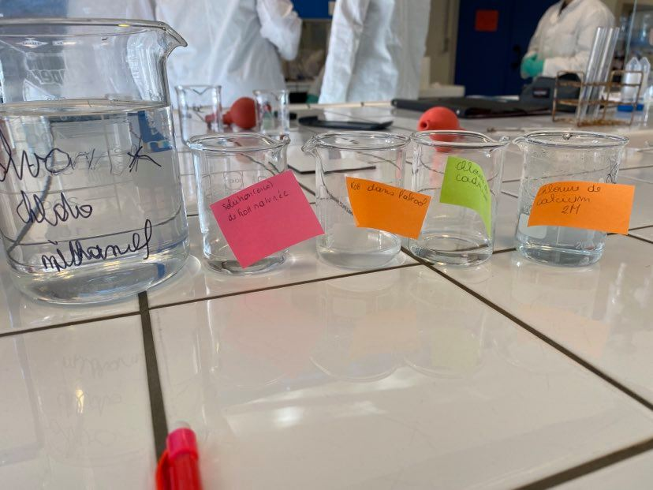
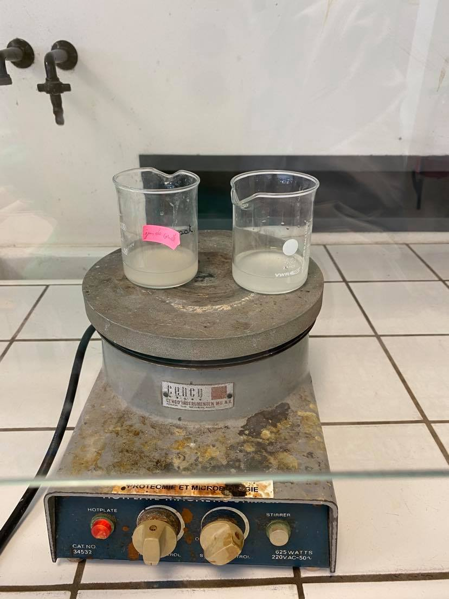
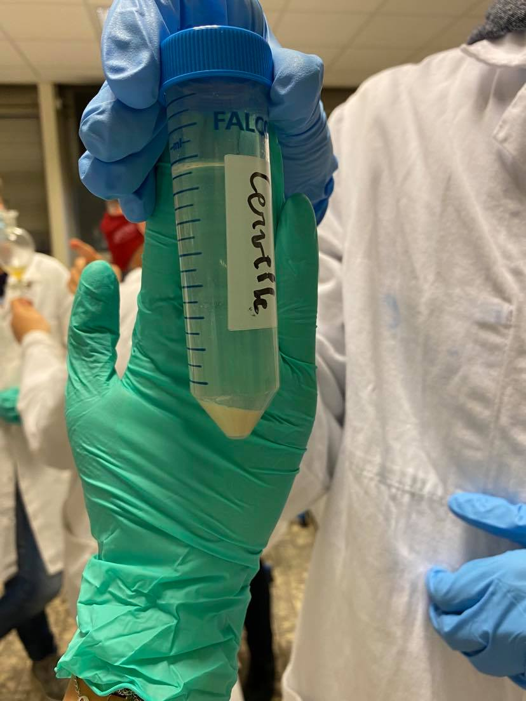
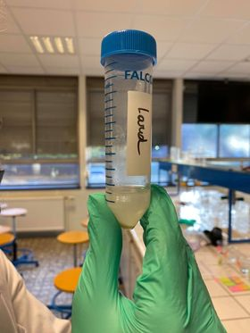
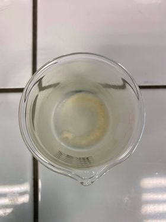
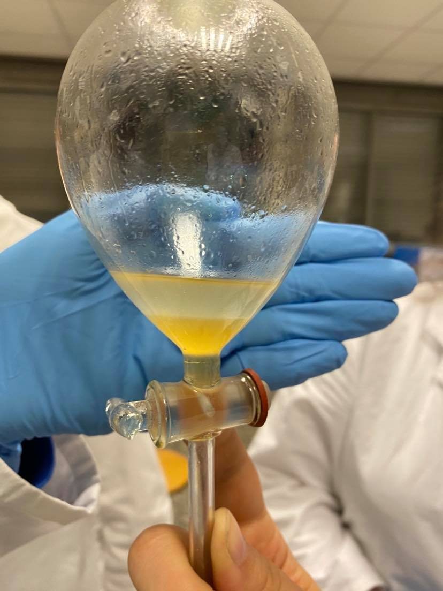

***
```{r setup, include=FALSE}
knitr::opts_chunk$set(echo = TRUE)
SciViews::R
library(dplyr)
library(ggridges)
library(knitr)
# Excel import packages
library(readxl)
```

## **Atelier 4:** Les Lipides

### Introduction
  
#### Qu’est-ce qu’un lipide?
Les lipides sont des molécules amphiphiles à caractère hydrophobe prononcé. A température ambiante, les lipides peuvent être à l'état solide(cires) ou liquide (huiles). Ceux-ci contituent la matière grasses des êtres vivants et ils sont l'un des constituants majeurs des membranes organiques. On peut les classer en trois groupes : 
* **Les Phospholipides :** sont des lipides de structure et il y en existe 2 groupes: les glycérophospholipides et les sphingolopides.
* **Les Glycolipides:** leur rôle est de stabiliser la membrane cellulaire et il y en existe 2 groupe: les sphigolipides et les glactolipides.
* **Les Stéroïdes**: n'ont rien avoir avec la struture des acides gras comme les deux autres. Leur molécule est constitué de cycle et jouent un rôle d'hormones. C'est pourquoi, ils n'interviennent pas au niveau de la structure des mebranes.
Les stéroïdes et le phosphatidylinositol (glycérophospholipides) sont les seuls lipides à porter un rôle informationnel.
  
### But
Préparer des solutions qui nous permettront de séparer les trois principales classes de lipides -à savoir les triacylglycérols, les phospholipides et le cholestérol- à partir de cervelle et de lard (mammifères) sur base de leur affinité en fonctions des solvants utilisés.
  
### Matériel
  
#### Préparation des solutions
* [1] 500 mL de solvant chloroforme (166,67 mL) et méthanol (333,333 mL).
  + 15 g de lard + 40 mL de solvant chloroforme-méthanol.
  + 15 g de cervelle + 40 mL de solvant chloroforme-méthanol.
* [2] Solution KOH saturée
  + 10g de KOH
  + 9mL de H20d
* [3] Solution KOH dans l'alcool
  + 1,2 mL solution [2] KOH saturée
  + 10,8 mL alcool dénaturé (éthanol 100%)
* [4] 10mL Chlorure de cadmium (solution saturée dans l'alcool éthylique)
* [5] Chlorure de calcium 2M
  + 10g CaCl2
  + 33 mL
* [6] 66 mL Ether diéthylique
* [7] 100 mL Acétone
  

  
### Méthode
  
#### Séparation des lipides
Cette séparation des lipides s’est déroulée en deux étapes. Tout d’abord, il a fallu extraire le lard et la cervelle: 15g de chaque tissu fut prélevé et placé dans 40 ml de solvant. Chaque extrait a été broyé avec un mixeur de marque Moulinex avec un mélange de méthanol/chloroforme (1 pour 2). Les résidus restants ont été éliminés par filtration à travers étamine pour qu'il n'y ait plus de résidus insolubes.
  
Une fois la première étape terminée, les deux extraits furent mis sous hotte. Le solvant fut ensuite éliminé par évaporation sur une plaque électrique.
  


##### Précipitation de phospholipides (figures 3 et 4)
Après refroidissement, les résidus de l'évaporation furent dissous dans 2 mL d'éther [6]. 
  
**Note:** Pour la cervelle, nous avons dû OCTUPLER les quantités de solvant (16 mL d'éther, 40 gouttes de CdCl2 et 48 mL d'acétone) car apparemment l'échantillon était saturé en graisses. 
  
Les produits de dissolution du lard furent ensuite versés dans un  tube à centrifuger avec 5 gouttes de CdCl2 [4] et 6 mL d'acétone [7] (fois 8 pour la cervelle), puis les deux tubes passèrent à la centrifugeuse.
  
##### Saponification des graisses neutres (figure 5)
Dans le surnageant, il ne resta plus que les graisses neutres et le cholestérol. Il a fallu décanter ce surnageant dans un bécher attitré au lard ou à la cervelle. Une solution de KOH alcool fut ajoutée et le tout fut mélangé. 
  
**Note: Le surnageant de cerveau faisait 38 mL, et le culot occupait jusqu'à 2 ml dans le flacon. Nous avons donc décider de quadrupler la quantité de KOH Alcool (24 mL)[3], même si en ratio ça aurait dû être ±4,75 fois plus.**
  
Ensuite,ce mélange fut placé sous hotte, chauffé et évaporé. Suite à cette étape, il ne subsistait que le savon, masse informe au fond du bécher (sels de potassium).
  
##### Séparation des savons et du cholestérol (figure 6)
Une fois que le bécher "contenant la cervelle" a été refroidit. Nous avons dissout le savon(cervelle) à l’aide de 7ml d’alcool à 50%. Ensuite, nous avons transvasé le tout dans une ampoule à décanter avec ajout de  10ml d’éther de pétrole. Enfin, la cristalisation du cholestérol fut réalisée par évaporation du solvant la phase organique grâce à une plaque chauffante.
  
##### Précipitation des savons calciques (figure 7)
Dès que le bécher contenant le lard eu fini de refroidir, nous avons incorporé son contenu dans 20ml d’eau. 
  
Nous avons ensuite incorporé ces 20 ml dans deux tubes (10 mL chaque). Dans l'un, nous avons ajouté petit à petit 10 gouttes de CaCl2 2M [5]. Dans l'autre, 10 gouttes d’acide acétique.
  
### Résultats et discussion
  
#### Précipitation des phospholipides
  
##### Résultats
Le culot du tube falcon contenant la cervelle était plus important que celui du lard. En outre, le surnageant présentait une couleur jaunâtre dans le deux cas.
  

  

  
##### Discussion
Etant donné que les sels de cadmium phospholipides sont insolubles dans une solution d'acétone et d’éther, nous pouvons observer un précipité dans le fond du tube. Il y a néanmoins une différence de volume entre le surnageant de cervelle et de lard, due là l'octuplation des doses de solvants.
  
Les phospholipides ont formé un culot par précipitaton due au sel de cadmium. Le surnageant, quant à lui, s'est formé par réaction de l’éther et de l’alcool avec les graisses neutres et le cholestérol.
  
Vu que les phospholipides font partie inhérente des membranes cellulaire, il est logique de constater un culot plus important dans le tube falcon de la cervelle. En effet, le cerveau contient beaucoup plus de cellules que le lard, qui est principalement composé de gros adipocytes. Vu que les adipocytes sont plus gros que les neurones et autres petites cellules du cervelet, il y aura moins de cellules par unité de volume dans le lard, et donc moins de membranes cellulaires, ce qui implique un plus petit culot de phospholipides.
  
#### Saponification des graisses neutres
  
##### Résultats
Nous avons pu observer une fine couche de couleur brune/jaunâtre dans le fond des béchers.
  

  
##### Discussion
Cette couche jaunâtre représente les acides gras, saponifiés en savons potassiques. En effet, laa saponification s'est effectuée lorsque les graisses furent mélangées au KOH-alcool et placées sur une plaque chauffante sous hotte. Après évaporation, il ne restait donc plus que le produit de la saponification dans le fond du bécher: les sels de potassium. 
  
Théoriquement, le potassium (K+) a réagi avec le carboxyle, et le groupement hydroxyle (OH-) a formé le glycérol.
  
#### Séparation des savons et du choléstérol
  
##### Résultats
Ces résultats nous viennent du groupe 1 car nous n'avons malheureusement pas eu le temps de recommencer cette manipulation.
Nous pouvons voir deux phases clairement distinguables dans l'ampoule à décanter (figure 4): Une phase organique contenant le cholésstérol et une phase aqueuse contenant les savons. Au final, nous avons obtenu ±1.5 g de choléstérol cristalisé par évaporation du solvant de la phase organique. 
  

  
##### Discussion
Nous avons utilisé de l’alcool et de l’éther de pétrole afin d’obtenir les deux phases (aqueuse et organique) nécessaires à la décantation. Dans cette ampoule (figure 5) nous avons donc pu observer deux phases, une phase organique avec le cholestérol et une phase aqueuse avec les savons. Nous avons donc laissé s’écouler la phase aqueuse et l'éther de pétrole a été recueilli dans un bêcher sec. Il fut laissé à évaporer sous la hotte. Pour ce qui en est du cholestérol, il a cristallisé.
  
#### Précipitation des savons calciques
  
##### Résultats
Nous avons donc deux tubes:
  
* **Eprouvette n°1: 10 mL de jus de lard + 10 gouttes de CaCl2 2M**
Cette éprouvette a présenté une réaction de précipitation semblable à une émulsion. Ils forment un précipité plus épars et volumineux que le précipité du tube 2. 
  
* **Eprouvette n°2: 10 mL de jus de lard + 10 gouttes d’acide acétique**
Cette éprouvette présente une réaction de précipitation plus classique avec un "précipitat" plus dense dans le fonc du tube. 
  
Le volume apparent de précipitation dans les tubes semble plus important dans le tube contenant du CaCl2 que dans celui contenant de l'acide acétique. 
  

  
##### Discussion
Théoriquement, dans le CaCl2 (Ca++, 2 Cl-), le calcium, de valence 2, va pouvoir accepter 2 têtes hydrophiles de triglycérides, tandis que l’acide acétique (CH3COO- , H+ ) ne va pouvoir se lier qu’à une tête hydrophile. 
  
De plus, les 2 Cl- libérés par la solution de CaCl2 vont réagir plus efficacement que la fonction COO- unique de l'acide acétique avec la liaison ester des acides gras , ce qui permet au CaCl2 de les précipiter plus facilement en les séparant rapidement de leur glycérol.
  
A volume égal, nous allons donc observer plus de précipités dans la solution de chlorure de calcium que dans celle contenant l'acide acétique.

### Conclusion
La séparation des différents lipides des échantillons de cervelle et de lard permit de constater une plus grande abondance phospholipidique dans le tissu de cervelle que dans le tissu du lard en raison d'une présence cellulaire plus marquée dans la cervelle.
  
De plus, la quantité de cholestérolsemble également plus importante dans la cervelle, et ce grâce à l'abondance d'hormones stéroïdiennes dont la structure est basée sur ce même cholestérol.
  
Le lard, quant à lui, possède bien plus de triglycérides (graisses neutres) que la cervelle, étant bien plus gras en tant que tissu de soutien.
  
### Bibliographie
* Colignon, L. (2020). Travaux pratiques de biochimie 2020-2021, protocole Moodle.
  
* Gillan, D. (2018?). Biologie Générale fascicule 1 et 4, Syllabus didpensé par l'Umons, pages diverses.
