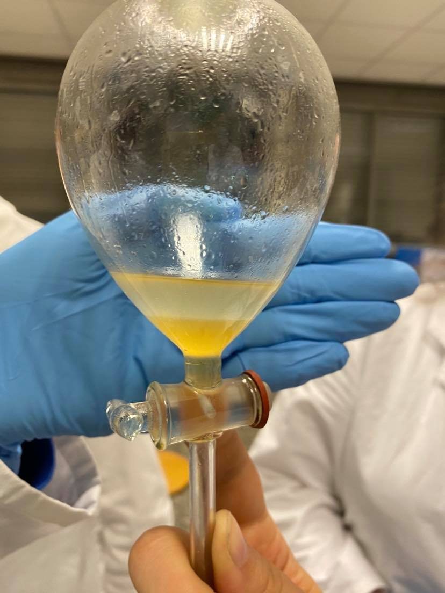

```{r setup, include=FALSE}
knitr::opts_chunk$set(echo = TRUE)
```

## **Atelier 4:** Les Lipides

### Introduction
#### Qu’est-ce qu’un lipide?
Les lipides sont des molécules amphiphiles à caractère hydrophobe prononcé. A température ambiante, les lipides peuvent être à l'état solide(cires) ou liquide (huiles). Ceux-ci contituent la matière grasses des êtres vivants et ils sont l'un des constituants majeurs des membranes organiques. On peut les classer en trois groupes : 
* Les Phospholipides : sont des lipides de structure et il y en existe 2 groupes: les glycérophospholipides et les sphingolopides.
* Les Glycolipides: leur rôle est de stabiliser la membrane cellulaire et il y en existe 2 groupe: les sphigolipides et les glactolipides.
* Les Stéroïdes: n'ont rien avoir avec la struture des acides gras comme les deux autres. Leur molécule est constitué de cycle et jouent un rôle d'hormones. C'est pourquoi, ils n'interviennent pas au niveau de la structure des mebranes.
Les stéroïdes et le phosphatidylinositol (glycérophospholipides) sont les seuls lipides à porter un rôle informationnel.

<!---
D’un point de vue biologique :
* 20% du poids corporel.
* Réserve énergétique.
* Rôles de précurseurs (Vitamines, stéroïdes,…).
* Composante de la bicouche lipidique des cellules.
* Constituants alimentaires (Beurre, fromage,…).
--->
  
### But
Préparer des solutions qui nous permettront de séparer les trois principales classes de lipides : les triacylglycérols, les phospholipides et le cholestérol, à partir de cervelle et de lard (mammifères) sur base de leur affinité en fonctions des solvants utilisés.
  
### Matériel
  
#### Préparation des solutions
* [1] 500 mL de solvant chloroforme (166,67 mL) et méthanol (333,333 mL).
  + 15 g de lard + 40 mL de solvant chloroforme-méthanol.
  + 15 g de cervelle + 40 mL de solvant chloroforme-méthanol.
* [2] Solution KOH saturée
  + 10g de KOH
  + 9mL de H20d
* [3] Solution KOH dans l'alcool
  + 1,2 mL solution [2] KOH saturée
  + 10,8 mL alcool dénaturé (éthanol 100%)
* [4] 10mL Chlorure de cadmium (solution saturée dans l'alcool éthylique)
* [5] Chlorure de calcium 2M
  + 10g CaCl2
  + 33 mL
* [6] 66 mL Ether diéthylique
* [7] 100 mL Acétone
  


### Méthodes
  
#### Séparation des lipides
Cela s’est déroulé en deux étapes. Tout d’abord, il a fallu extraire le lard et la cervelle : 15g de chaque tissus pour 40 ml de solvant. Chaque extrait a été broyé mécaniquement avec un mélange de méthanol/chloroforme (1 pour 2). Les résidus restants ont été éliminés par filtration à  travers étamine pour qu'il n'y ait plus résidus insolubes. 
Une fois la première étape terminée, on a mis sous hotte,les deux extraits. Le solvant fut éliminé par évaporation sur une plaque électrique.


##### Précipitation de phospholipides
Après refroidissement, les résidus de l'évaporation furent dissous dans 2 mL d'éther [6]. Pour la cervelle cependant, nous avons dû OCTUPLER les quantités de solvant (16 mL d'éther, 40 gouttes de CdCl2 et 48 mL d'acétone) car apparemment, l'échantillon était saturé en graisses. Les produits de dissolution du lard furent ensuite versés dans un  tube à centrifuger avec 5 gouttes de CdCl2 [4] et 6 mL d'acétone [7](cervelle avec quantités octuplées), puis les deux tubes sont passés à la centrifugeuse.


Nous pouvont voir qu'il y a une différence de volume entre la cervelle et le lard. N'oublions pas que nous avons dû octupler les doses de solvants.
Etant donné que les sels de cadmium phospholipides sont insolubles dans une solution d'acétone et d’éther, nous devrions pouvoir apercevoir un précipité dans le fond du tube.
  
##### Saponification des graisses neutres
Dans le surnageant, il ne reste que les graisses neutres et le cholestérol. Il a fallu décanter ce surnageant dans un bécher attitré au lard ou à la cervelle. Une solution de KOH alcool fut ajoutée et le tout fut mélangé. 
Le surnageant de cerveau faisait 38 mL, et le culot occupait jusqu'à 2 ml dans le flacon. Nous avons donc décider de quadrupler la quantité de KOH Alcool (24 mL)[3], même si en ratio ça aurait dû être 4,75 fois plus.

Ensuite,ce mélange fut placé sous hotte, chauffé et évaporé. Cette étape provoqua la saponification des graisses neutres. Suite à cette étape, il ne subsistait que le savon, masse informe au fond du bécher (sels de potassium).
Le potassium va réagir avec le carboxyle, et le groupement hydroxyle va former le glycérol.  Les acides gras ainsi libérés ont été présents sous forme de savons (sels de potassium).
  
##### Séparation des savons et du cholestérol
Une fois le bécher,contenant la cervelle, refroidit. Nous avons dissout le savon(cervelle) à l’aide de 7ml d’alcool à 50%. Ensuite, nous avons transvasé le tout dans une ampoule à décanter avec ajout de  10ml d’éther de pétrole.
  
Dans cette ampoule(figure 5) nous avons pu observer deux phases, une phase organique avec le cholestérol et une phase aqueuse avec les savons. Finalement, nous avons laissé s’écouler la phase aqueuse et l'éther de pétrole est recueilli dans un bêcher sec, jusqu’à son évaporation sous la hotte. Pour ce qui en est du cholestérol, il s’est cristallisé en aiguille.


  
  
##### Précipitation des savons calciques
Une fois le bécher, contenant le lard, refroidit. Nous avons repris le résidu du bécher à l’aide de 20ml d’eau et l’avons mélangé. Au plus ces résidus sont abondants, au plus la solution doit être visqueuse, dans notre cas nous n'avons pas eu énormément.

Ensuite, avec les 20ml, nous les avons mis dans deux tubes, de 10ml chacun. Dans l'un, nous avons ajouté petit à petit 10 gouttes de CaCl2 2M [5] , et 10 gouttes d’acide acétique dans l’autre. Les acides gras se sont précipités.
Théoriquement, dans le CaCl2 (Ca++, 2 Cl- ), le calcium, de valence 2, va pouvoir accepter 2 têtes hydrophiles des triglycérides, tandis que l’acide acétique (CH3COO- , H+ ) ne va pouvoir se lier qu’à une tête hydrophile. Du coup, nous devrions observer, en quantités égales, deux fois plus de précipités dans la solution de chlorure de calcium.


### Résultats

### Discussion

  
### Conclusion


### Bibliographie


